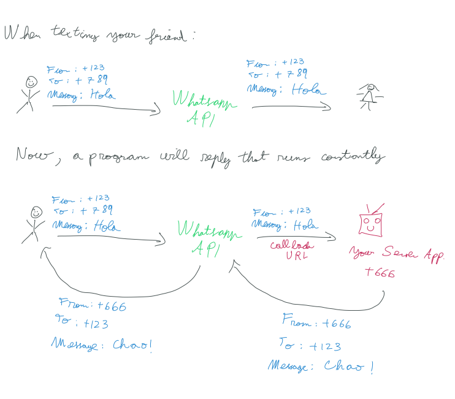
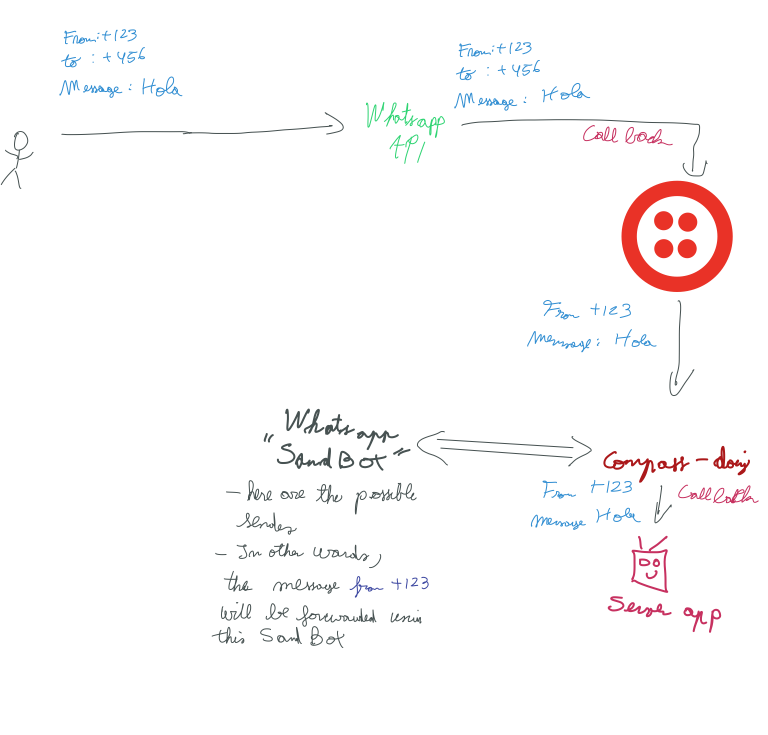

# Whatsapp Bot

Here are some temporary sketches of my work





## Pre-requisities

* Python >= 3.5
    * **Note**: The `dialogflow` package does not support Python 2 according to [their website](https://dialogflow-python-client-v2.readthedocs.io/en/latest/)
* The following software needs to be install:
```
dialogflow==1.0.0
  - google-api-core [required: >=1.14.0,<2.0.0dev, installed: 1.22.1]
    - google-auth [required: >=1.19.1,<2.0dev, installed: 1.20.1]
      - cachetools [required: >=2.0.0,<5.0, installed: 4.1.1]
      - pyasn1-modules [required: >=0.2.1, installed: 0.2.8]
        - pyasn1 [required: >=0.4.6,<0.5.0, installed: 0.4.8]
      - rsa [required: >=3.1.4,<5, installed: 4.6]
        - pyasn1 [required: >=0.1.3, installed: 0.4.8]
      - setuptools [required: >=40.3.0, installed: 49.2.1]
      - six [required: >=1.9.0, installed: 1.15.0]
    - googleapis-common-protos [required: >=1.6.0,<2.0dev, installed: 1.52.0]
      - protobuf [required: >=3.6.0, installed: 3.13.0]
        - setuptools [required: Any, installed: 49.2.1]
        - six [required: >=1.9, installed: 1.15.0]
    - protobuf [required: >=3.12.0, installed: 3.13.0]
      - setuptools [required: Any, installed: 49.2.1]
      - six [required: >=1.9, installed: 1.15.0]
    - pytz [required: Any, installed: 2020.1]
    - requests [required: >=2.18.0,<3.0.0dev, installed: 2.24.0]
      - certifi [required: >=2017.4.17, installed: 2020.6.20]
      - chardet [required: >=3.0.2,<4, installed: 3.0.4]
      - idna [required: >=2.5,<3, installed: 2.10]
      - urllib3 [required: >=1.21.1,<1.26,!=1.25.1,!=1.25.0, installed: 1.25.10]
    - setuptools [required: >=34.0.0, installed: 49.2.1]
    - six [required: >=1.10.0, installed: 1.15.0]
Flask==1.1.2
  - click [required: >=5.1, installed: 7.1.2]
  - itsdangerous [required: >=0.24, installed: 1.1.0]
  - Jinja2 [required: >=2.10.1, installed: 2.11.2]
    - MarkupSafe [required: >=0.23, installed: 1.1.1]
  - Werkzeug [required: >=0.15, installed: 1.0.1]
grpcio==1.31.0
  - six [required: >=1.5.2, installed: 1.15.0]
gunicorn==20.0.4
  - setuptools [required: >=3.0, installed: 49.2.1]
pipdeptree==1.0.0
  - pip [required: >=6.0.0, installed: 20.2.1]
pylint==2.5.3
  - astroid [required: >=2.4.0,<=2.5, installed: 2.4.2]
    - lazy-object-proxy [required: ==1.4.*, installed: 1.4.3]
    - six [required: ~=1.12, installed: 1.15.0]
    - typed-ast [required: >=1.4.0,<1.5, installed: 1.4.1]
    - wrapt [required: ~=1.11, installed: 1.12.1]
  - isort [required: >=4.2.5,<5, installed: 4.3.21]
  - mccabe [required: >=0.6,<0.7, installed: 0.6.1]
  - toml [required: >=0.7.1, installed: 0.10.1]
twilio==6.45.0
  - PyJWT [required: >=1.4.2, installed: 1.7.1]
  - pytz [required: Any, installed: 2020.1]
  - requests [required: >=2.0.0, installed: 2.24.0]
    - certifi [required: >=2017.4.17, installed: 2020.6.20]
    - chardet [required: >=3.0.2,<4, installed: 3.0.4]
    - idna [required: >=2.5,<3, installed: 2.10]
    - urllib3 [required: >=1.21.1,<1.26,!=1.25.1,!=1.25.0, installed: 1.25.10]
  - six [required: Any, installed: 1.15.0]
wheel==0.34.2
```

## Acknowledgement

* [Dialogflow API Reference](https://dialogflow-python-client-v2.readthedocs.io/en/latest/)